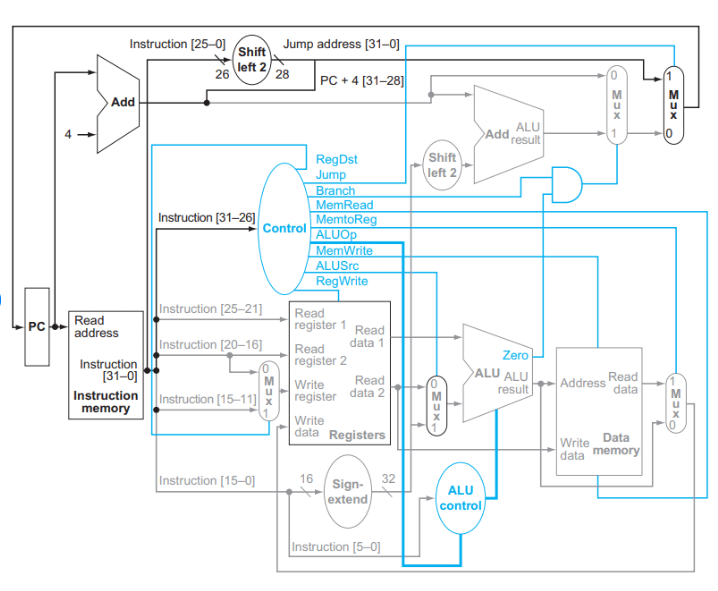

## Sobre o Projeto

Este projeto visa a implementação de um processador MIPS monociclo utilizando a linguagem VHDL. O MIPS (Microprocessor without Interlocked Pipeline Stages) é uma arquitetura de processador que utiliza um conjunto reduzido de instruções (RISC), o que simplifica o hardware e melhora a eficiência do processamento. A implementação monociclo, onde cada instrução é executada em um único ciclo de clock, facilita a compreensão da arquitetura MIPS e serve como uma excelente ferramenta educacional para estudantes e entusiastas de hardware.

## Características

- **Arquitetura MIPS Monociclo**: Implementação simplificada, ideal para fins educacionais.
- **Escrito em VHDL**: Utiliza a linguagem VHDL para a descrição do hardware, permitindo simulação e síntese para FPGAs ou ASICs.
- **Suporte a Instruções Básicas**: Capaz de executar um subconjunto de instruções da arquitetura MIPS, incluindo operações aritméticas, lógicas, de controle de fluxo e acesso à memória.
- **Simulação e Testes**: Inclui scripts e testbenches para simulação das funcionalidades do processador, facilitando a verificação e o debug.

## Estrutura do Projeto

O projeto está organizado da seguinte forma:
- Todos os arquivos necessários estão no diretório raiz.

## Requisitos

Para executar e modificar este projeto, você precisará de:

- Um ambiente de desenvolvimento VHDL (Quartus)

## Como Usar

1. **Baixe o Quartus**
2. **Abra o Projeto**:
   - Selecione o arquivo de base do projeto no Quartus, assim o projeto e os componentes serão carregados
3. **Simulação**:
   - Utilize o testbench `mips_tb.vhd` para simular o processador e verificar sua funcionalidade, na memória contém um programa que gera os números de fibbonacci utilizando os comandos da arquitetura MIPS.

## Ilustrção da aquitetura:

